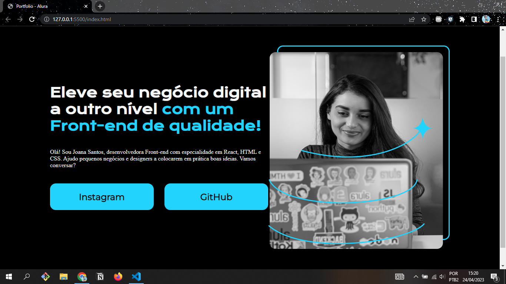

<h1 align="center"> Portfolio - Alura </h1>

 Site desenvolvido ao estudar HTML e CSS, pela formação A partir do zero: HTML e CSS para projetos web, na plataforma Alura.  

## Cursos

HTML e CSS: ambientes de desenvolvimento, estrutura de arquivos e tags

Projeto Final:

  

Conceitos Aprendidos:
- Preparar o Ambiente para o desenvolvimento de um Site;
- Estudar uma tecnologia com base na documentação;
- Criar um projeto com HTML e CSS do zero;
- Layout e tags semânticas;
- Como utilizar o CSS na prática;
- Cores, Destaque de texto.

 

HTML e CSS: Classes, posicionamento e Flexbox

Projeto Final:

  

Conceitos Aprendidos:
- Seletores e posicionamento;
- Flexbox;
- Height e box-sizing;
- Viewport;
- Importar fonts do google fonts;
- Manipular botões;
- Recurso gap.

## 🚀 Tecnologias

Esse projeto foi desenvolvido com as seguintes tecnologias:

- HTML e CSS
- Git e Github
