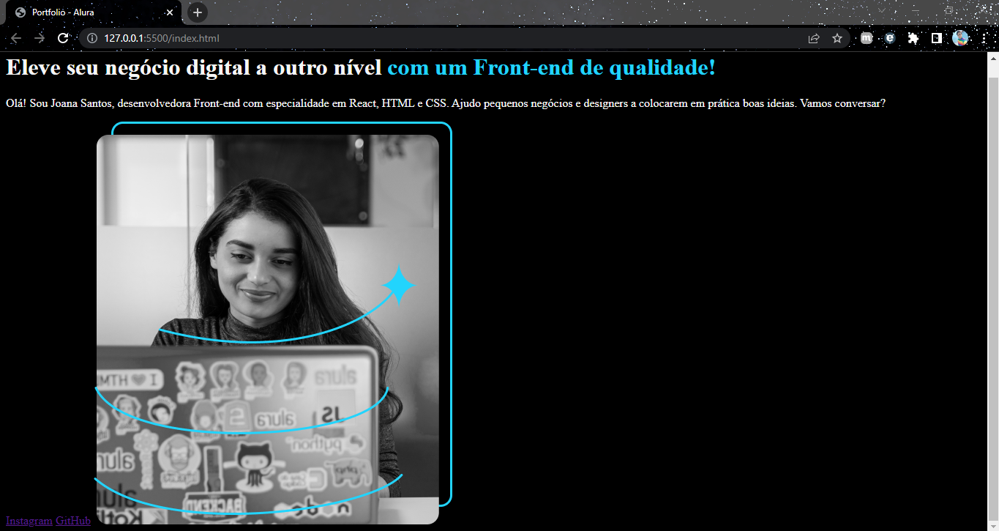

<h1 align="center"> Portfolio - Alura </h1>

Site desenvolvido durante os cursos:  
HTML e CSS: ambientes de desenvolvimento, estrutura de arquivos e tags

 

  

## 🚀 Tecnologias

Esse projeto foi desenvolvido com as seguintes tecnologias:

- HTML e CSS
- JavaScript
- Git e Github